<div align="center">

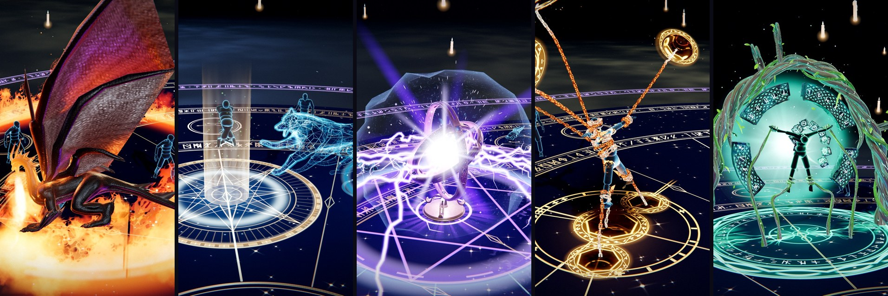

# Elemental Sandbox

**Nine cinematic spells, cast in real time in your browser.**<br>
Hand-written GLSL, ragdoll physics, and over a thousand live controls you can drag while the frame is frozen.

<br>

[](https://abilitycastingthreejs.chirovisuals.xyz)


[**The spellbook**](#the-spellbook) · [**Features**](#whats-inside) · [**Quick start**](#quick-start) · [**Controls**](#controls) · [**How it works**](#how-it-works)

</div>

<br>

## The spellbook

Press a key and a targeting circle follows your cursor across the floor. Click, and the show begins.
Every frame on this page is the renderer's own output, straight from the running sandbox, with no
compositing or touch-up.

<table>
<tr>
<td align="center" width="33%"><a href="#abyssal-maw"></a><br><b>Abyssal Maw</b><br><sub><kbd>K</kbd> · targeted</sub></td>
<td align="center" width="33%"><a href="#chains-of-penance">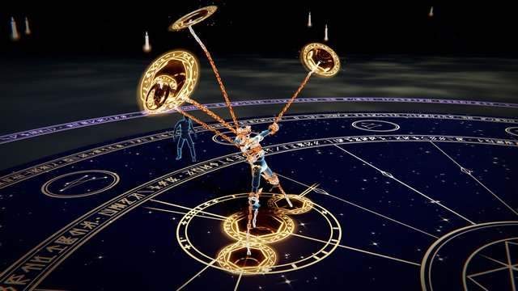</a><br><b>Chains of Penance</b><br><sub><kbd>L</kbd> · targeted</sub></td>
<td align="center" width="33%"><a href="#dragonfire-circle">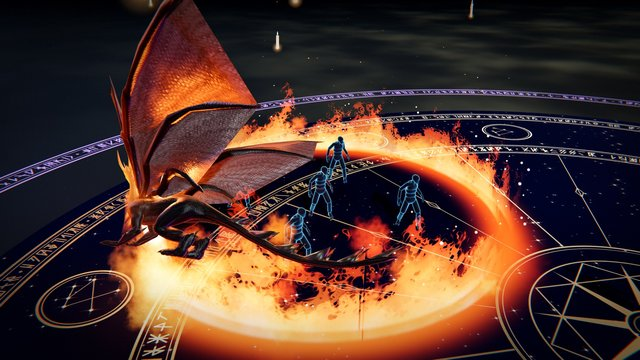</a><br><b>Dragonfire Circle</b><br><sub><kbd>I</kbd> · area</sub></td>
</tr>
<tr>
<td align="center"><a href="#stormheart-gyroscope"></a><br><b>Stormheart Gyroscope</b><br><sub><kbd>O</kbd> · area</sub></td>
<td align="center"><a href="#amethyst-verdict">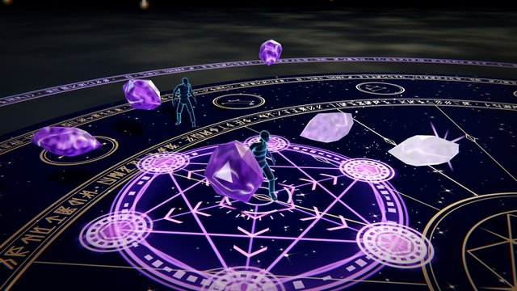</a><br><b>Amethyst Verdict</b><br><sub><kbd>U</kbd> · targeted</sub></td>
<td align="center"><a href="#astral-tome">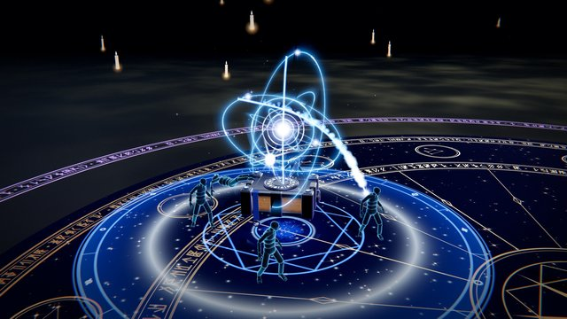</a><br><b>Astral Tome</b><br><sub><kbd>;</kbd> · area</sub></td>
</tr>
<tr>
<td align="center"><a href="#wildroot-reliquary">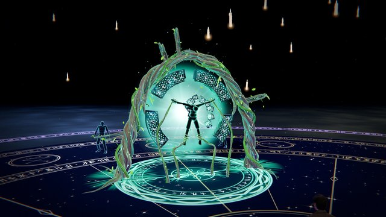</a><br><b>Wildroot Reliquary</b><br><sub><kbd>'</kbd> · targeted</sub></td>
<td align="center"><a href="#starbreaker-lance"></a><br><b>Starbreaker Lance</b><br><sub><kbd>Y</kbd> · targeted</sub></td>
<td align="center"><a href="#astral-fang">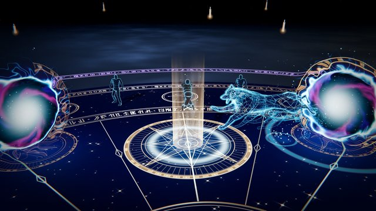</a><br><b>Astral Fang</b><br><sub><kbd>B</kbd> · targeted</sub></td>
</tr>
</table>

<sub>**Area** casts hit everyone in the circle. **Targeted** casts lock the circle onto the body under the cursor and take that one.</sub>

---

<a id="abyssal-maw"></a>

### 🦈 Abyssal Maw &nbsp;<kbd>K</kbd>

<table><tr>
<td width="50%"></td>
<td width="50%">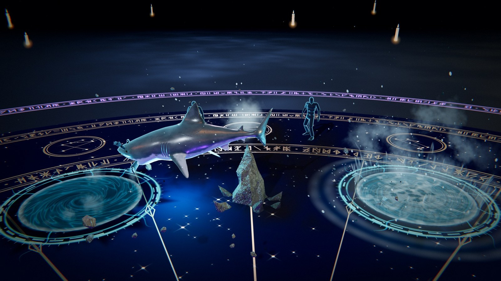</td>
</tr></table>

Two portals of deep water tear open in the floor. A spike of rock kicks the target into the air,
and a great white breaches the near portal, snatches it at the top of the kick, shakes it and dives
into the far portal. Both portals spiral shut behind it.

<details>
<summary><b>How it's built</b></summary>

- The portals are **real holes**: the floor shader is cut wherever one is open (`world/FloorHoles.js`), with a lit well of water underneath.
- The leap is **solved, not keyframed**. The arc's gravity is fitted every frame so the jaw arrives at the body on the exact frame the authored bite clip snaps shut.
- The body isn't parented to the shark. One joint is pinned in the jaw (`Ragdoll#pin`) and the rest hangs and swings under gravity.

</details>

<a id="chains-of-penance"></a>

### ⛓️ Chains of Penance &nbsp;<kbd>L</kbd>

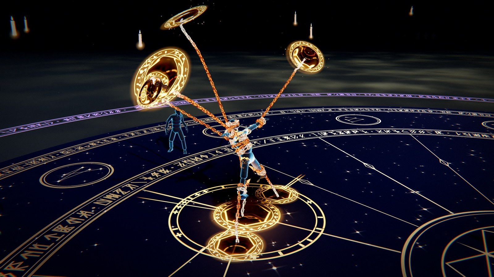

Seven portals of gold filigree inscribe themselves around the target. A barbed chain shoots out of
each one, wraps around a limb and hauls the body into the air. They pull in jerks until the sockets
give, then tear it apart limb by limb, dragging each piece back through its own portal.

<details>
<summary><b>How it's built</b></summary>

- Each chain coil is measured in the bone's own frame, so it turns with the arm instead of sliding around it.
- `Ragdoll#loosen` turns joint constraints from rods into ropes, so the skin visibly stretches over the gap before `Dummy#tear` splits the mesh along its skin weights.
- Every limb is cut off by its portal's plane as it passes through (`Dummy#clip`). Every link of every chain is one instanced draw.

</details>

<a id="dragonfire-circle"></a>

### 🐉 Dragonfire Circle &nbsp;<kbd>I</kbd>

<table><tr>
<td width="50%"></td>
<td width="50%">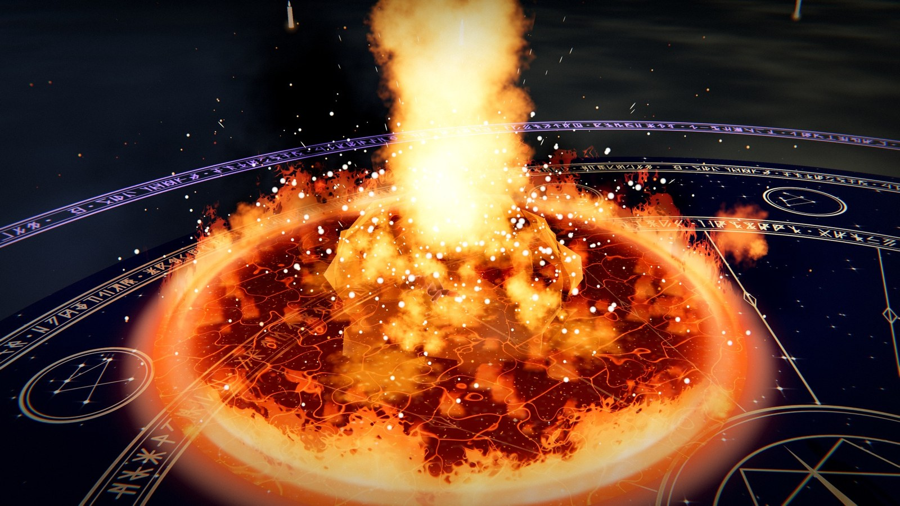</td>
</tr></table>

The sky tears open and a dragon dives *through* the rift. It flies one lap of the circle and breathes
the ring of fire onto the edge, one point at a time. Then the fire turns inward: a burning front
sweeps to the centre, setting every body alight as it reaches them, and the middle erupts.

<details>
<summary><b>How it's built</b></summary>

- The dragon's hide is cut along the portal's plane with a molten band, so it emerges from the tear rather than fading in.
- The ring, the inward front and the blaze are all shaders reading the same few uniforms. Each point of the wall lights up as the breath passes it.
- It sets `handlesOwnHits`, so bodies burn only when the front actually reaches them.

</details>

<a id="stormheart-gyroscope"></a>

### ⚡ Stormheart Gyroscope &nbsp;<kbd>O</kbd>

<table><tr>
<td width="50%">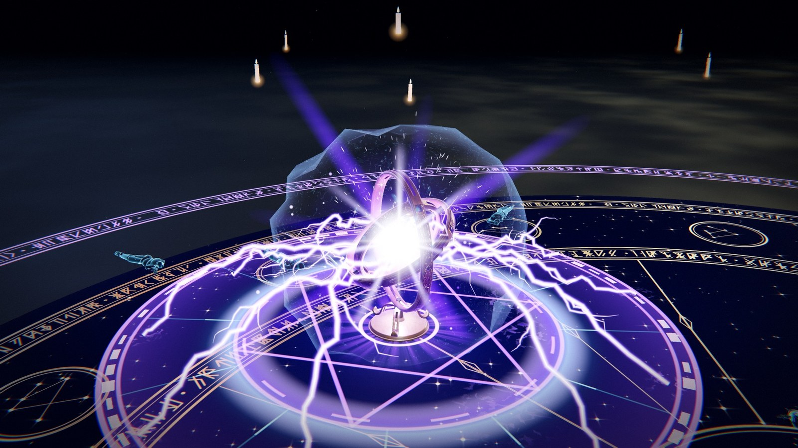</td>
<td width="50%">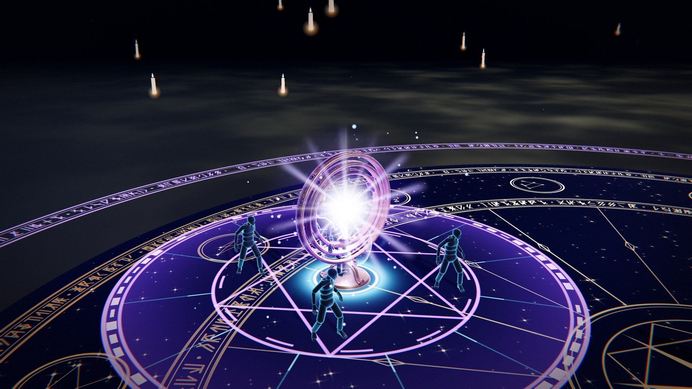</td>
</tr></table>

A brass gyroscope condenses out of violet fire over the circle, its rings spinning. A star ignites
in its core and it starts firing lightning into the nearest body, forking and chaining from one
target to the next. It ends in an overload that discharges into everything still standing.

<details>
<summary><b>How it's built</b></summary>

- Every bolt has a leader, a return stroke, re-strikes and forks, and can jump on to the next body near the one it hit.
- With nobody left in the circle, it strikes the floor.
- The model sits behind `GyroscopeRig`, which hands over a core position, a height and a ring radius. That's the whole contract.

</details>

<a id="amethyst-verdict"></a>

### 💎 Amethyst Verdict &nbsp;<kbd>U</kbd>

<table><tr>
<td width="50%">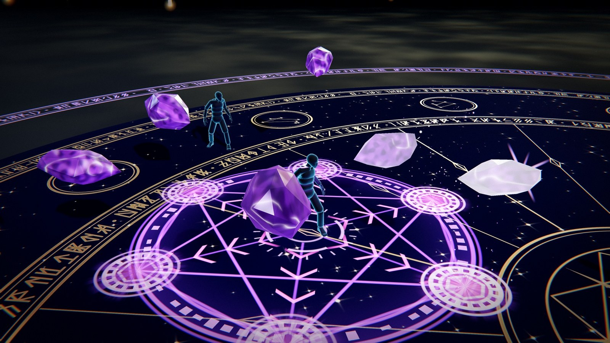</td>
<td width="50%">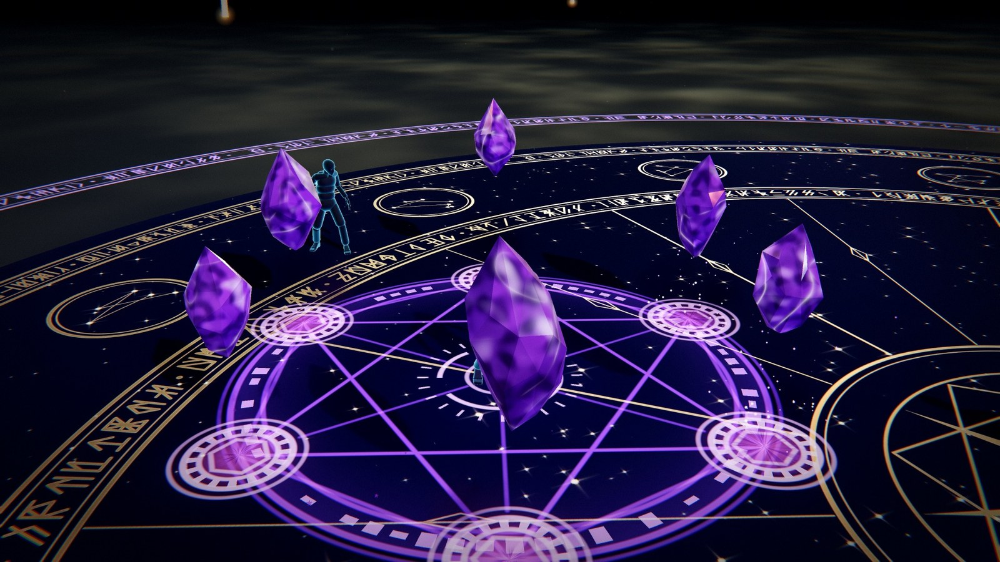</td>
</tr></table>

Five to eight sockets inscribe themselves around the target and an amethyst point rises from each,
charging. One by one, in an order the target can't predict, they aim, draw back and drill into it,
shattering into real pieces that stay on the floor. Then the circle detonates.

<details>
<summary><b>How it's built</b></summary>

- The stones are loaded from `models/amethyst_stones.glb`. The shattered pieces are instanced, up to 220 per cast.
- Each impact drives the body in a new direction, so the ragdoll is knocked back and forth before the finale throws it upward.

</details>

<a id="astral-tome"></a>

### 📖 Astral Tome &nbsp;<kbd>;</kbd>

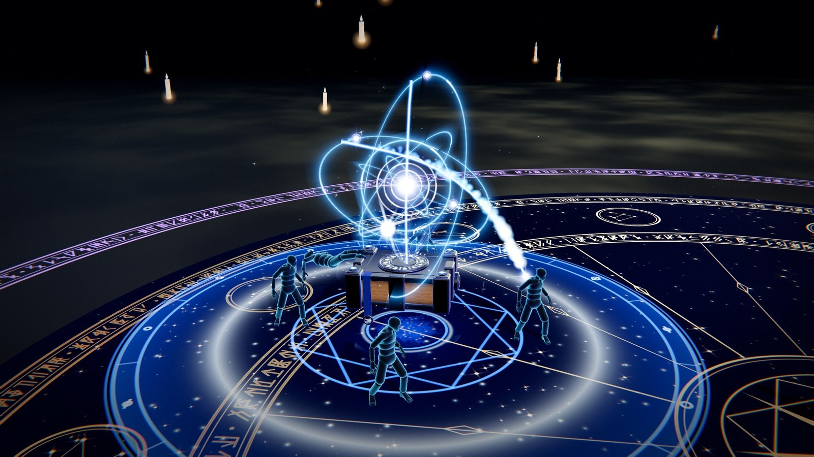

A tome burns into being at your shoulder, sails to the circle and opens. A star rises from its dial
and an orrery draws itself around it. One by one, planets break orbit and fall on the bodies below
as streaks of light.

<details>
<summary><b>How it's built</b></summary>

- Six orbits at different tilts, inner planets running faster. Each falling planet draws a Bézier beam behind it, then regathers on its orbit.
- When the tome closes, the star throws a light at everyone still standing.

</details>

<a id="wildroot-reliquary"></a>

### 🌿 Wildroot Reliquary &nbsp;<kbd>'</kbd>

<table><tr>
<td width="50%"></td>
<td width="50%">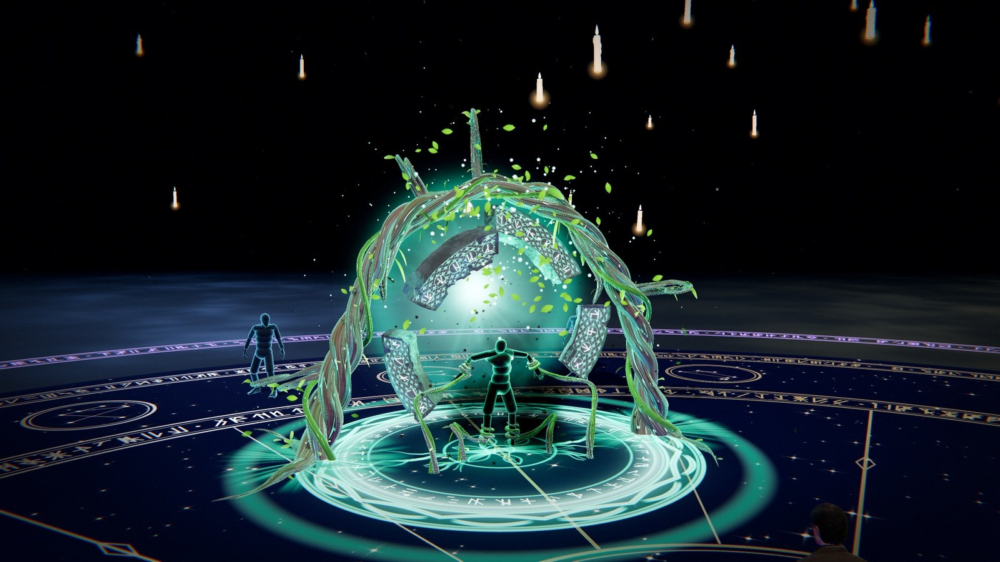</td>
</tr></table>

Two great braided roots burst from the floor and arch over the target. A ring of carved runestones
rises inside them, tendrils bind the wrists and ankles, and the body is hung in the ring while bark
creeps over it. Then the arch clenches like a fist and drags it into the earth. A sapling grows
where it stood.

<details>
<summary><b>How it's built</b></summary>

- **No root is a mesh.** Each is a curve re-solved on the CPU every frame (Catmull-Rom, resampled by arc length, parallel-transported frames) and written to a float texture. The vertex shader winds every strand around it (`assets/RootGeometry.js`).
- That's what lets a root grow, wither, and wrap a forearm the ragdoll moved this frame.
- The slabs were cut in Blender with carving masks stored in vertex colour, and the lattice and runes are carved in the shader.

</details>

<a id="starbreaker-lance"></a>

### ✴️ Starbreaker Lance &nbsp;<kbd>Y</kbd>

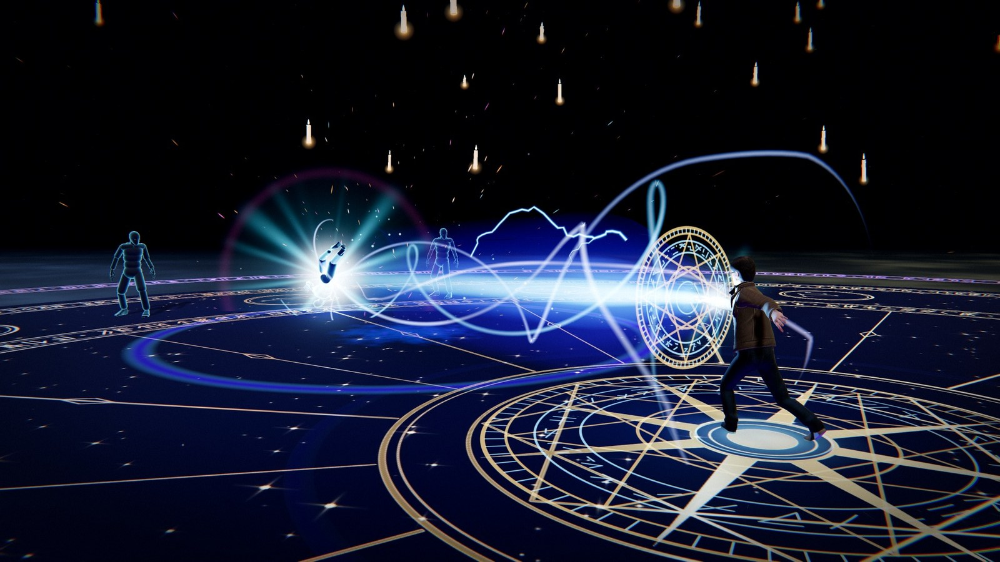

A magic circle writes itself under you and light gathers between your hands. Then the beam fires:
a white core, a cyan sheath and violet streamers twisting around it. The target is blown off its
feet and driven along the line, then burns away to light.

<details>
<summary><b>How it's built</b></summary>

- The beam starts at the caster's hands and follows them through the cast animation, every frame.
- Up to twelve streamers of 160 points each, all in one instanced draw.

</details>

<a id="astral-fang"></a>

### 🐺 Astral Fang &nbsp;<kbd>B</kbd>

<table><tr>
<td width="50%"></td>
<td width="50%">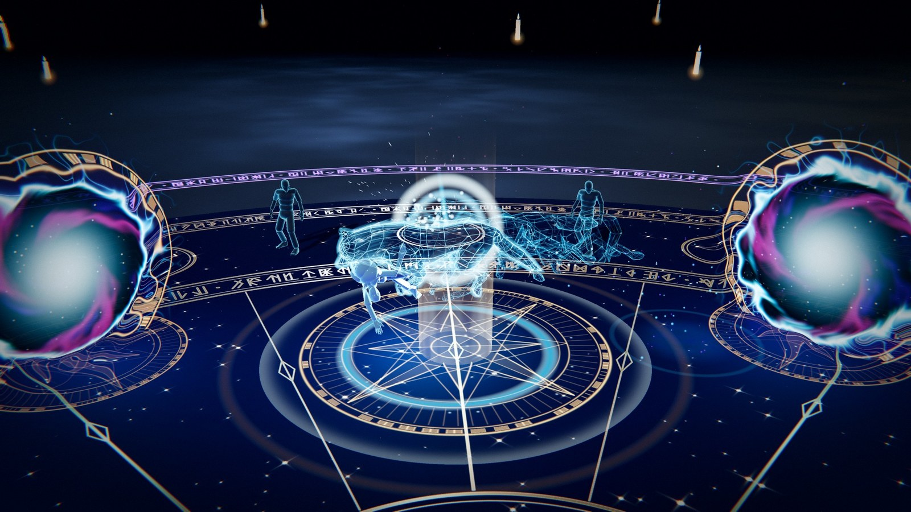</td>
</tr></table>

A gold compass rose marks the target and a rift tears open beside it. A wolf of starlight gallops
out, a column of light lifts the body, and the wolf pounces, catches it in its jaws, and carries it
into a second rift.

<details>
<summary><b>How it's built</b></summary>

- The gallop is played against ground speed, so the paws never skate.
- The leap starts on the exact frame of the authored pounce, and its arc is solved so the jaw closes on the body.
- Wolf and body are cut by the far rift's plane as they cross it.

</details>

---

<a id="whats-inside"></a>

## What's inside

<table>
<tr>
<td width="33%" valign="top">

#### 🎛️ Edit while paused

Press <kbd>P</kbd> to freeze any frame, then reshape it in the editor. A cast stores only a seed and a few timestamps, so every slider rewrites a spell that's already mid-air.

</td>
<td width="33%" valign="top">

#### 🧍 Real ragdolls

The target dummies have a position-based ragdoll. Spells pin, stretch, tear, slice, sink and corrode them instead of playing canned death animations.

</td>
<td width="33%" valign="top">

#### ✋ Hand tracking

Press <kbd>M</kbd> and cast with your webcam: an open palm aims and a fist casts. It uses MediaPipe, with a live gesture guide for each spell.

</td>
</tr>
<tr>
<td valign="top">

#### 📱 Phone as camera

No webcam? Scan a QR code and your phone streams to the PC over WebRTC.

</td>
<td valign="top">

#### 🏰 The Duel Hall

A floating, cloth-draped platform modelled in Blender. Press <kbd>`</kbd> to burn the gothic hall around it away, or raise it again.

</td>
<td valign="top">

#### 🎨 Presets

Save and share looks: export to JSON, import, duplicate, or reset to the shipped defaults.

</td>
</tr>
</table>

---

## Quick start

```bash
npm install
```

```bash
npm run dev
```

Open the URL Vite prints (default <http://127.0.0.1:5173>). To use a phone as the camera, start with
`npm run dev:lan` instead. It serves over HTTPS on your LAN.

```bash
npm run build
```

---

## Controls

| Input | Action |
| --- | --- |
| <kbd>K</kbd> <kbd>L</kbd> <kbd>I</kbd> <kbd>O</kbd> <kbd>U</kbd> <kbd>;</kbd> <kbd>'</kbd> <kbd>Y</kbd> <kbd>B</kbd> (or <kbd>1</kbd>–<kbd>9</kbd>) | Arm a spell |
| **Mouse** / **left click** | Move the circle / cast |
| <kbd>Esc</kbd> / **right click** | Cancel |
| **Right drag** / **scroll** | Orbit / zoom |
| <kbd>G</kbd> | VFX editor |
| <kbd>P</kbd> | Pause (the editor keeps applying) |
| <kbd>`</kbd> | Castle on / off |
| <kbd>C</kbd> / <kbd>T</kbd> | Clear effects / reset dummies |
| <kbd>M</kbd> / <kbd>J</kbd> | Camera mode / swap hands |
| <kbd>H</kbd> | Hide the help panel |

<details>
<summary><b>Using your phone as the camera (local only)</b></summary>

<br>

Run `npm run dev:lan`, open the app from the address it prints, press <kbd>M</kbd> and click
**Use your phone as the camera** (the panel opens by itself if the PC has no webcam). Scan the QR
code, accept the certificate warning and tap **Start camera**.

The video goes straight from phone to PC over WebRTC. Only the handshake goes through a server: a
small Vite plugin ([`tools/vite-plugin-phone-camera.js`](tools/vite-plugin-phone-camera.js)). That
means the feature works only under the dev server.

- **HTTPS is required**: phone browsers only expose the camera to secure origins.
- **Same network, with device-to-device traffic allowed.** Guest networks and client isolation block it. Windows Firewall may ask to allow Node the first time.

</details>

---

<a id="how-it-works"></a>

## How it works

<details>
<summary><b>Settings are the API</b></summary>

<br>

`src/config/settings.js` is the single source of truth. Shaders, particles, lights and post passes
*read* it every frame, and no cast copies a value at spawn time. That's what lets the editor
reshape a spell mid-flight, even while paused.

```js
import { settings } from './config/settings.js';
settings.shark.portalRadius = 2.6; // visible on the next frame, mid-leap
settings.dragon.zoneRadius = 8;    // a bigger ring for the dragon to fly
settings.global.timeScale = 0.1;   // slow everything to a crawl
```

</details>

<details>
<summary><b>Models behind a contract</b></summary>

<br>

Every loaded model sits behind a rig in `src/assets/` (`DragonRig`, `WolfRig`, `TomeRig`…) that
hands the ability a canonical size, origin and pose call. Abilities know nothing about the file, so
swapping a model means touching only its rig.

</details>

<details>
<summary><b>Render pipeline</b></summary>

<br>

1. **Depth prepass**: half-res packed depth, so every VFX shader gets soft intersections.
2. **Distortion pass**: portals, rifts and refraction write screen-space offsets to a second half-res buffer.
3. **Composer**: scene → refraction warp → ACES → a single grade pass (chromatic aberration, colour, vignette, grain, impact flash).

One directional light has a 4096² shadow map refitted around the character every frame (~1.3 cm per
texel). Contact shadows are rendered from below and blurred. Lights are parked at zero intensity
rather than added or removed, so materials never recompile mid-cast. Every ability is pre-built
behind the loading screen, so the first cast costs the same as the fiftieth.

</details>

<details>
<summary><b>Adding an ability</b></summary>

<br>

1. Add a settings block and an entry in `ELEMENTS` / `ELEMENT_META` (`snap: true` for a targeted cast).
2. Subclass `Ability`.
3. Register it in `abilities/AbilityManager.js`.
4. Add an editor folder in `ui/Editor.js` and a sigil in `ui/glyphs.js`.
5. Bind a key in `input/InputManager.js`.

Pooling, the targeting circle, cooldowns and the HUD slot come for free.

</details>

<details>
<summary><b>Project layout</b></summary>

<br>

```
src/
  abilities/      the nine abilities, their base class and the pooling manager
  assets/         model rigs, chain links, root curves
  combat/         target dummies and their ragdoll
  config/         settings.js — every parameter
  core/           App, Renderer, CameraRig, Time, Layers
  effects/        aim indicators, decals, bursts, lightning, shake, flash
  input/          keyboard/mouse, hand tracking, phone camera
  materials/      one material set per ability
  particles/      GPU particle system
  postprocessing/ composer, grade, distortion
  ui/             HUD, lil-gui editor, presets, camera panel
  world/          Duel Hall, floor (and the holes in it), lighting
art/              Blender sources: the Duel Hall and the wolf
promo/pipeline/   scripts that capture the promo videos and these screenshots
```

</details>

---

<div align="center">

**[▶ Try it live](https://abilitycastingthreejs.chirovisuals.xyz)** · Made by [@chirovisuals](https://x.com/chirovisuals) · [chirostudio.xyz](https://chirostudio.xyz)

<sub>Code is provided as-is. The HDR probe, the character FBX and third-party models keep their original licences.</sub>

</div>
