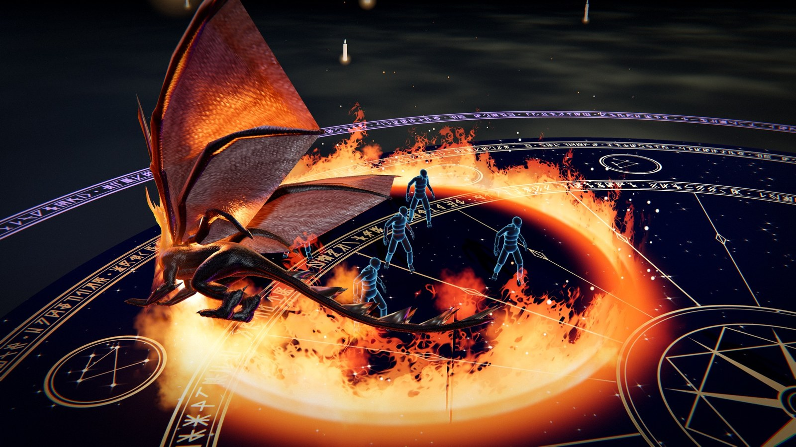
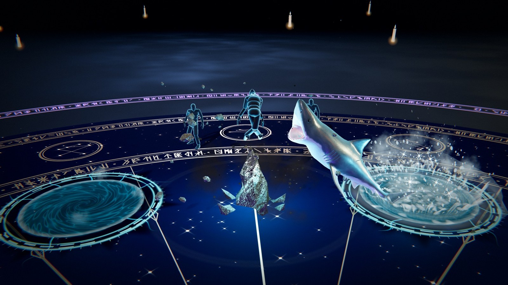
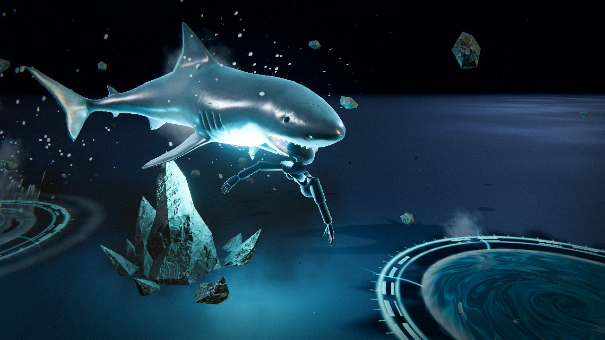
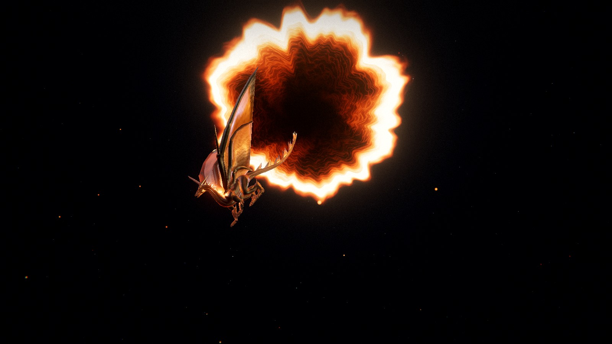
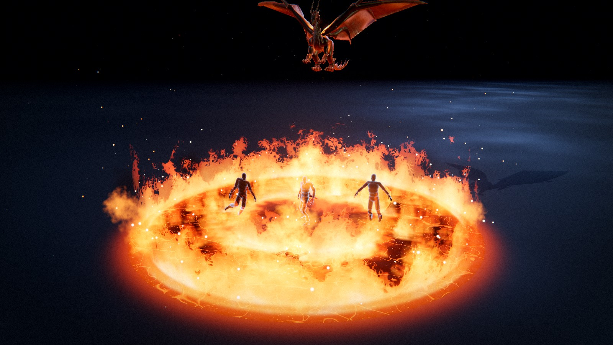

# Elemental Sandbox

A VFX sandbox for spells you aim at the ground, built with **Three.js**, **Vite** and hand-written **GLSL**.




Nine abilities, all of them **far casts**. Press a key and a circle with a thick boundary follows the
cursor across the floor. It shows how much space the spell will take before you commit. Five of
them are **targeted**: the circle locks onto the body under the cursor, because they take one
target rather than an area. Click to cast.

They are staged on the **Duel Hall**, a floating, cloth-draped platform built in Blender. It can
stand inside a round gothic hall or float over an open stage that runs out into fog.

---

## The nine abilities

They are listed in slot order, which is also the order of the number keys.



**K — Abyssal Maw** · <sub>targeted</sub> — two portals of deep water tear open in the floor on
either side of the target. A spike of rock bursts up under the body and kicks it into the air. A
great white (`models/shark.glb`) breaks out of the near portal and catches it in its jaws at the
top of the kick. It shakes the body, rolls with it and dives into the far portal. Both portals spiral
shut behind it. The portals are real holes: the floor shader is cut wherever one is open
(`world/FloorHoles.js`), and a lit well of water sits under each one. The leap is *solved*, not
keyframed. The arc's gravity is fitted so the jaw reaches the body on the frame the authored clip
snaps shut. The body is not parented to the shark. One joint is pinned in the jaw (`Ragdoll#pin`)
and the rest of it hangs and swings under gravity.



**L — Chains of Penance** · <sub>targeted</sub> — seven portals open around the target: four in
the air, two in the floor at its feet and one under it. Each one is drawn as gold filigree with an
iris of black lacquer opening onto a tunnel of rune light. A barbed chain is thrown out of each
portal and wraps around a limb. Together the chains lift the body and hold it spread in the air.
They pull in jerks until the sockets give (`Ragdoll#loosen`) and the seams glow (`Dummy#strain`).
Then the limbs tear off one at a time (`Dummy#tear`), and each is pulled back through its own
portal and cut off by it (`Dummy#clip`). The links are a procedural tube in one instanced draw.



**I — Dragonfire Circle** · <sub>area</sub> — the longest show in the sandbox. A fuse of embers
runs out to the circle and the sky above it tears open. A dragon (`models/dragon.glb`) dives out
*through* the tear: its hide is cut along the portal's plane with a molten band. It flies one lap
just outside the circle and breathes the ring of fire onto the edge, one point at a time as the
breath passes. It climbs back into the tear. Then the fire turns inward: a burning front runs from
the ring to the middle. It leaves char and glowing cracks behind it, and every body catches fire
when the front reaches it. The middle erupts, the floor cools to ash, and the char fades last.



**O — Stormheart Gyroscope** · <sub>area</sub> — a sigil writes itself round the circle and a
brass gyroscope (`models/magical_gyroscope.glb`) forms out of violet fire above it, rings spinning.
A star lights in its core. On every `strikeInterval` it fires a bolt into the nearest body in the
circle. Each bolt has a leader, a return stroke, re-strikes and forks, and can jump on to the next
body. When nobody is left, it strikes the floor. It ends with an overload: a ring of bolts to the
edge, one into every body still standing, and a shock across the floor. Then it burns back into
the rune.

**U — Amethyst Verdict** · <sub>targeted</sub> — a ring of five to eight sockets is drawn around
the target. An amethyst point (`models/amethyst_stones.glb`) rises out of each one and hangs there,
charging. Every stone turns to aim at the body, draws back and comes in, one after another, in an
order the body cannot predict. Each one shatters on impact into real pieces that land and stay on
the floor. Once the last stone has broken, the circle goes off and throws the body into the air.

**; — Astral Tome** · <sub>area</sub> — a tome (`models/arcane_tome.glb`) forms at the caster's
shoulder and flies to the middle of the circle. There it grows to full size and opens. A star
rises out of the dial on its cover, and an orrery draws itself around it, with tilted orbits, a
planet on each and a field of stars. On every `strikeInterval` a planet breaks free of its orbit
and comes down on the nearest body as a beam of light. When it ends, the star strikes everyone
still standing and the orrery folds back into the book.

**' — Wildroot Reliquary** · <sub>targeted</sub> — two great braided roots burst out of the floor
and arch over the target, with vines, curling tendrils and leaves opening along them. A broken ring
of carved slabs (`models/wildroot_reliquary.glb`) rises into the arch. Four tendrils wrap around the
wrists and ankles and hang the body in the ring while bark creeps over it (`Dummy#corrode`). The
runes light, the arch closes like a hand and the roots drag the body into the earth. A glowing
sapling grows where it stood. None of the roots is a mesh. Each one is a curve the CPU re-solves
every frame and writes into a float texture, and the vertex shader wraps every strand around its
curve (`assets/RootGeometry.js`).

**Y — Starbreaker Lance** · <sub>targeted</sub> — a magic circle appears under the caster and
light gathers into a star between the hands. Then a beam fires into the target: a white core, a
cyan sheath and a violet glow, with streamers twisting round it. The impact throws the body back,
and the beam stays on it and drives it along the line. The beam then collapses into the mark and
the body burns away to light. The beam starts at the caster's hands and follows them through the
cast animation.

**B — Astral Fang** · <sub>targeted</sub> — the Abyssal Maw's idea on dry land. A gold compass rose
is drawn on the floor under the target, and a rift opens beside it. A wolf of starlight
(`models/wolf.glb`) gallops out of the rift, its gallop synced to its ground speed so the feet do not
slide. A column of light lifts the body. The wolf leaps on the first frame of its authored pounce,
and its arc is solved so its jaw closes on the body. It lands, runs on with the body in its jaws
and goes into a second rift. Both are cut by the rift's plane as they pass through it.

---

## Every cast is live

Every parameter is a live control: over a thousand sliders and toggles, plus around 150 colour
pickers. They stay live while the simulation is paused. Freeze a frame mid-cast with **P**, then
change the silhouette, the colours and the timing against a still image.

That works because of one rule. A cast captures **a seed and a handful of timestamps**, nothing
else. Every metre, radian and second is resolved against `settings` inside the update loop, which
runs on zero-length frames too. Dragging a slider re-plans a shark leap that is already in the air,
or rearranges a set of chains that is halfway done.

---

## Quick start

```bash
npm install
```

```bash
npm run dev
```

Then open the URL Vite prints (default <http://127.0.0.1:5173>).

```bash
npm run dev:lan
```

The same, but reachable from other devices on your Wi-Fi over HTTPS, so you can
[use a phone as the camera](#using-your-phone-as-the-camera-local-only). Your browser will warn
about the certificate once. It is the dev server's own self-signed certificate.

```bash
npm run build
```

```bash
npm run preview
```

### Assets

Binary assets are served from `public/` and loaded at boot:

| File | Purpose |
| --- | --- |
| `public/models/Idle.fbx` | The rigged character **and** its idle clip |
| `public/models/diffuse.png` | The character's colour map |
| `public/models/cast1.fbx` – `cast3.fbx` | Cast animations, one picked per ability (`castAnim`) |
| `public/models/dummy.fbx` | The target dummies' rig |
| `public/models/duel_hall.glb` | The Duel Hall: platform, hall, shelves, candles, orrery |
| `public/models/shark.glb` | The great white, its `Swim` and `Breach` clips, and the rock |
| `public/models/dragon.glb` | The Dragonfire Circle's dragon |
| `public/models/magical_gyroscope.glb` | The Stormheart Gyroscope |
| `public/models/amethyst_stones.glb` | The Amethyst Verdict's crystal points |
| `public/models/arcane_tome.glb` | The Astral Tome |
| `public/models/wildroot_reliquary.glb` | The Reliquary's carved slabs and rune cubes, with carving masks in vertex colour |
| `public/models/wolf.glb` | The Astral Fang's wolf, with its gallop and pounce |
| `public/hdri/spruit_sunrise.hdr` | Image-based lighting and reflections (never shown as a sky) |
| `public/textures/cathedral/*.jpg` | The ambientCG Rock030 stone scan |
| `public/textures/duelhall/*` | Cloth, banners, stained glass and rune maps baked out of the hall |
| `public/mediapipe/` | The hand landmarker model and its WASM, for camera mode |

The Blender sources for the hall and the wolf are in `art/`.

The four character FBX files are Mixamo exports of the same rig. The cast files are loaded only for
their clips. Clips bind to the skeleton by bone name, so an animation from another file plays here
without retargeting. Each ability picks its clip with `castAnim` (a dropdown under **The cast** in
its editor folder). The clip is a one-shot layered over the looping idle.

---

## Controls

| Input | Action |
| --- | --- |
| **K** (or **1**) | Abyssal Maw: a rock kicks the target up, a shark takes it under |
| **L** (or **2**) | Chains of Penance: chains from portals tear the target apart |
| **I** (or **3**) | Dragonfire Circle: a dragon draws a ring of fire, then the fire burns inward |
| **O** (or **4**) | Stormheart Gyroscope: lightning into everyone in the circle |
| **U** (or **5**) | Amethyst Verdict: amethyst points rise round the target and crush it |
| **;** (or **6**) | Astral Tome: an orrery opens over the circle and its planets fall |
| **'** (or **7**) | Wildroot Reliquary: roots hang the target in runestones and drag it under |
| **Y** (or **8**) | Starbreaker Lance: a beam from your hands into one target |
| **B** (or **9**) | Astral Fang: a starlight wolf carries the target from one rift to another |
| **Move the mouse** | Move the circle |
| **Left click** | Cast |
| **Esc** / **right click** | Cancel an armed cast |
| **Right mouse + drag** | Orbit the camera |
| **Scroll** | Zoom |
| **`** | Castle on / off: burn the hall away, or raise it again |
| **G** | Show/hide the VFX editor |
| **P** | Pause / resume (*the editor keeps applying*) |
| **C** | Clear all active effects |
| **T** | Reset the target dummies |
| **M** | Camera mode: palm aims, fist casts (**J** swaps hands) |
| **H** | Hide the controls panel |

`range` and `minRange` are set per ability, so the circle's reach changes with the slot you have
selected. Cooldowns are also per ability, so casting one never locks another.

### Camera mode

Press **M** and the webcam drives the cast through MediaPipe hand tracking: an open palm aims and a
fist casts. The preview panel shows a **gesture guide** for the armed ability, with a tile for each
pose the tracker reads and what that pose does. The tile for the gesture being read lights up, so
you can see when a pose did not register. You can drag the panel anywhere on screen.

### Using your phone as the camera (local only)

No webcam, or a poor one? A phone on the same Wi-Fi can be the camera. Start the dev server with

```bash
npm run dev:lan
```

Open the app at the address it prints, press **M**, and click **Use your phone as the camera** in
the panel. The panel opens by itself when the PC has no webcam. Scan the QR code with the phone,
accept the certificate warning and tap **Start camera**. **Flip camera** switches between the front
and rear cameras. **Stop** on the phone or **Disconnect** on the PC switches back to the webcam.
Reloading the page keeps the pairing.

The video goes straight from the phone to the PC over WebRTC. Only the handshake needs a server,
and a small Vite dev-server plugin handles it
([`tools/vite-plugin-phone-camera.js`](tools/vite-plugin-phone-camera.js)). A built, deployed page
has no relay, so the panel shows that instead of a code. Two common problems:

- **HTTPS is required.** A phone browser only allows camera access on a secure origin, which is why
  this uses `dev:lan`.
- **Both devices must be on the same network, and it must allow device-to-device traffic.** Guest
  networks and "client isolation" block it. Windows Firewall may ask to allow Node on private
  networks the first time. If you refuse, the phone cannot connect.

---

## Project layout

```
src/
  abilities/      Ability base class, the nine abilities, and the pooling manager
  animation/      Character loading, AnimationMixer, the per-ability cast clips
  assets/         Rigs that adapt each model to a fixed contract (shark, dragon,
                  gyroscope, amethyst, tome, reliquary, wolf), the chain link,
                  and the root curves
  combat/         The target dummies: the field, one dummy, and its ragdoll
  config/         settings.js, the single source of truth for every parameter
  core/           App, Renderer, CameraRig, Time, Layers, shared frame uniforms
  effects/        Aim indicators, ground decals, bursts, lightning, light pool,
                  shake, flash
  input/          InputManager, AimController, HandInput (camera mode),
                  PhoneCamera + PhoneSignal (phone camera over WebRTC)
  loaders/        AssetLoader and the shared stone scan
  materials/      One material set per ability, plus the stone surface model
  particles/      GPU particle system and engine
  postprocessing/ Composer pipeline, grade shader, distortion shader
  shaders/lib/    Shared GLSL: noise library, common helpers
  phone/          The page the phone opens
  ui/             HUD, camera panel and gesture guide, phone pairing, contact
                  card, lil-gui editor, preset manager, styles
  utils/          Maths, colour cache, pooling, disposal, shader patching
  world/          Duel Hall, environment, floor (and the holes cut in it),
                  dust, contact shadows
  archive/        The retired four-element sandbox (see archive/README.md)
art/              Blender sources: the Duel Hall and the wolf
promo/pipeline/   Scripts that capture and compose the promo videos
tools/
  vite-plugin-phone-camera.js   Dev-server signalling relay for the phone camera
phone.html        The phone's page (dev server only; not a build input)
```

---

## How it fits together

### Settings are the API

`src/config/settings.js` holds every value you can change. Nothing else owns that state. Shaders,
particle systems, lights and post passes *read* those objects every frame, which is why the editor
works without a rebuild. Loading a preset deep-merges *into* the same objects, so every live
binding stays valid.

```js
import { settings } from './config/settings.js';
settings.shark.zoneRadius = 2;    // visible on the next frame, even mid-cast
settings.dragon.zoneRadius = 8;   // a bigger ring for the dragon to fly
settings.global.timeScale = 0.1;  // slow everything to a crawl
```

Ability blocks are keyed by their id in `ELEMENTS`. Shared systems (the aim controller, cooldowns,
the HUD) look them up as `settings[element]` and expect `range`, `minRange`, `speed`, `cooldown` and
`zoneRadius`. Everything else in a block belongs to that ability.

### Aiming

`AimController` raycasts the pointer onto the ground plane **every frame**, not only on mouse move,
so the circle stays under a still cursor while the camera orbits. It clamps the distance into
`[minRange, range]` and emits one `cast` event carrying an origin, a direction and a distance. It
runs on real time, so the indicator keeps animating while the sandbox is paused.

`ZoneIndicator` draws the circle on one quad. Its fragment shader converts UV into metres, so the
boundary keeps the same thickness at any radius. The circle **overshoots and settles back** when a
cast is armed. If `ELEMENT_META[element].snap` is set, the circle locks onto the body nearest the
cursor instead of following it.

### Models behind a contract

Each loaded model sits behind a rig in `assets/` (`DragonRig`, `TomeRig`, `WolfRig`…). The rig
returns the model in a known shape: canonical size, a known origin and the pose call that animates
it. The ability itself knows nothing about the file. Replacing a model means changing its rig.

### Bodies

The target dummies are Mixamo rigs with a position-based ragdoll underneath (`combat/Ragdoll.js`).
An ability that takes a body works through a small API on `Dummy`: `pin` holds one joint, `loosen`
lets a socket stretch, and `strain`, `tear`, `clip`, `sink` and `corrode` change the mesh. An
ability that decides for itself who is hit and when sets `handlesOwnHits`. Without it, the field
would knock down everyone in the circle on the frame the cast landed. The dragon, for example,
burns each body only when the fire front reaches it.

### The Duel Hall

The hall was modelled in Blender (`art/duel_hall/`). Its look is procedural node work that does not
survive glTF export. `world/DuelHall.js` therefore rebuilds every material by name: stone uses the
shared photographic scan, cloth and glass use maps baked out of the scene, and glows are additive
materials. Repeated props (256 bookshelves, about 250 candles) are folded into `InstancedMesh`es, so
the whole hall draws in under a hundred calls. The platform's top sits at y = 0 and uses the same
floor-hole discard as the ground, so portals open through it. **`** burns the castle away behind a
glowing edge, leaving the platform floating over the open stage.

### Render pipeline

Per frame:

1. **Depth prepass**: the opaque world into a half-res packed-depth buffer. VFX shaders sample it
   for soft intersections.
2. **Distortion pass**: meshes on the distortion layer write screen-space UV offsets into a second
   half-res buffer (portals, rifts, refraction).
3. **Composer**: scene → refraction warp → ACES tone map → grade. The grade pass combines chromatic
   aberration, lift/gain/contrast/saturation/temperature, vignette, film grain and the impact flash
   in one pass.

Shadows come from one directional light. Its orthographic shadow camera is re-centred on the
character each frame and covers a 52 m box at 4096² (about 1.3 cm per texel). Contact shadows are
rendered for real: the character's depth is captured from below, blurred and projected onto the
ground.

One three.js gotcha worth knowing: three keys its **program cache** on
`customProgramCacheKey()`, which defaults to `onBeforeCompile.toString()`. Materials patched by the
same helper therefore shared one compiled program and silently rendered with the wrong shader.
`utils/shaderPatch.js` adds the patch's own source to the key.

### Adding another ability

1. Add a settings block in `config/settings.js` and an entry in `ELEMENTS` / `ELEMENT_META` (set
   `snap: true` for a targeted cast).
2. Subclass `Ability`.
3. Register the class in `abilities/AbilityManager.js`.
4. Add an editor folder in `ui/Editor.js` and a sigil in `ui/glyphs.js`.
5. Bind a key in `input/InputManager.js`.

Pooling, the circle, cooldowns, aim reach and camera framing are inherited or driven by `ELEMENTS`.
The HUD builds its slots from that array.

---

## Editor and presets

Press **G** for the panel. It has folders for Presets, Global, the aim indicator, the far-cast
circle, each of the nine abilities, Environment, the Duel Hall, Post processing, Camera, Character
and the target dummies. Each ability's folder follows the order of its show: the cast, the timing,
then each beat in turn, then the palette and the light.

- **Global** multipliers scale everything at once: speed, glow, noise, particles, lights, impact
  intensity, camera shake and time scale.
- Every ability exposes **every** colour it uses, and none is derived from another.
- **Presets** save to `localStorage`. You can duplicate, delete, export to JSON, import from JSON
  or reset to the shipped defaults. A preset is a plain snapshot of the settings tree, so you can
  read and edit an exported file by hand.

---

## Performance notes

- Abilities, decals, bursts and particles are pooled per type. Every ability is pre-built behind the
  loading screen, so the first cast costs the same as the fiftieth.
- `MAX_CONCURRENT` in `AbilityManager` caps the sandbox at four concurrent casts and retires the
  oldest.
- Dynamic point lights are created at boot and set to zero intensity when unused, never added or
  removed. Changing the light count makes three recompile every material.
- Shadow maps update once per frame even though the scene is rendered several times.
- `renderer.compileAsync()` runs during boot so no cast stutters on shader compilation.
- Pixel ratio is capped at 1.75, and the depth and distortion buffers are half resolution.

Live counters (FPS, particles, instances, draw calls) are in the top-right of the HUD.

---

## The archive

`src/archive/` holds an earlier version of this project: a sandbox with four elements (fire, water,
earth, air) cast along a freehand spline. The live app imports none of it, so Vite never bundles
it. See `src/archive/README.md`.

---

## Known rough edges

- Every cast assumes a flat floor: the ground is a single plane at y = 0, and the aim raycast
  targets that plane.
- The targeting circle is additive, so it brightens the floor rather than shading it. On a pale
  floor it would need a darker pass underneath to stay readable.
- The phone camera is a dev-server feature. A deployed build would need a signalling backend (and a
  TURN server for devices off the LAN) before the panel could show a code.

---

## Licence

Code is provided as-is for the purposes of this project. The bundled HDR probe, the character FBX
and the third-party models keep their original licences.
